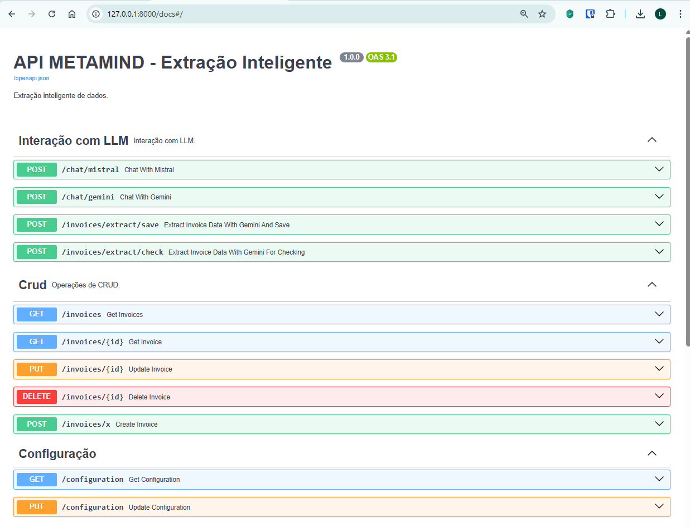
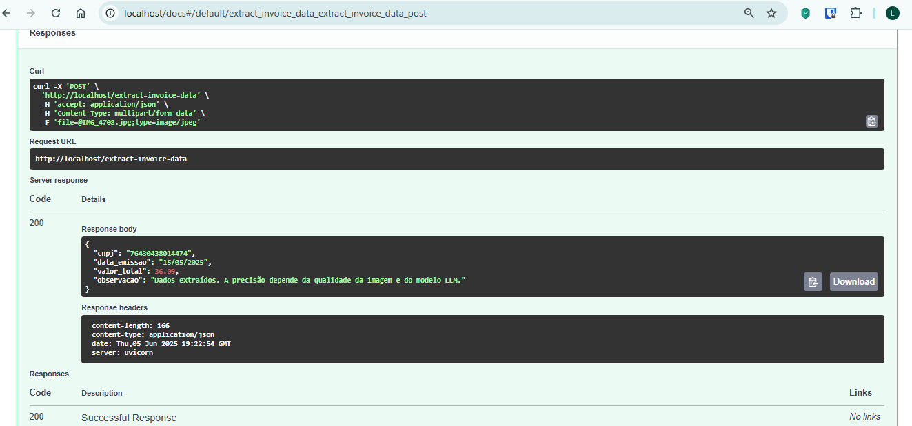
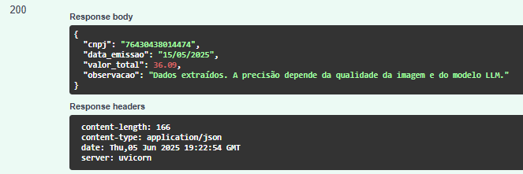
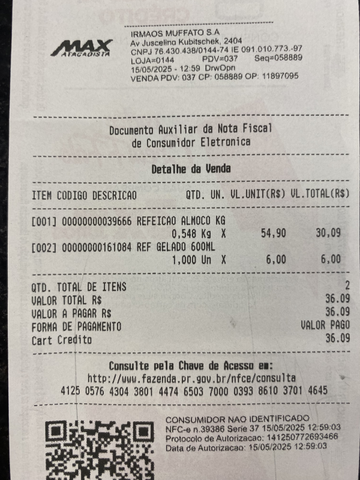

# poc-fastapi-llm
POC Fastapi com Gemini. Criado para o segundo trabalho do curso da I1A2 em Junho de 2025.

## Run

```
fastapi run app/main.py --port 8000
```

## Live reload

```
 uvicorn app.main:app --reload
```

## Acessar Swagger

```
http://localhost/docs#/default
```

## API Swagger

<div align="center">



</div>

## Teste

### teste no swagger

<div align="center">





</div>

### Nota utilizada

<div align="center">

 

</div>
